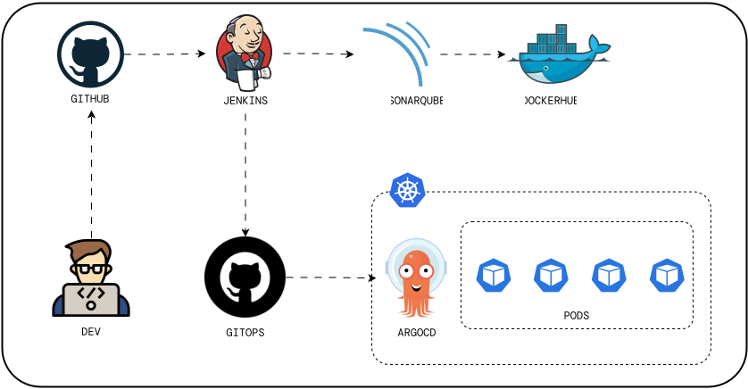

# Jenkins Java CICD Pipeline Documentation

## 1. Task Overview

This project implements a comprehensive CI/CD pipeline using Jenkins for a Spring Boot Java application. The pipeline automates building, testing, analysis, containerization, and deployment processes with integration to SonarQube for code quality and ArgoCD for GitOps-based deployment.

## 2. Tools and Technologies

### Development Tools
- Language: Java (Spring Boot)
- Version Control: GitHub
- Build Tool: Maven
- Code Quality: SonarQube

### DevOps and Infrastructure Tools
- CI/CD: Jenkins
- Containerization: Docker
- Container Registry: DockerHub
- GitOps Tool: ArgoCD
- Container Orchestration: Kubernetes

## 3. Detailed Scope of Implementation

### Key Automation Objectives

#### Continuous Integration
- Automated code checkout
- Maven-based build and test
- Static code analysis with SonarQube
- Docker image building and pushing

#### Continuous Deployment
- Automated deployment file updates
- Integration with ArgoCD
- GitOps-based deployment strategy
- Kubernetes orchestration

### Specific Implementation Features
- Multi-stage Jenkins pipeline
- Docker-based Jenkins agent
- Automated version management
- Credentials management for multiple services

## 4. Challenges and Solutions

### Technical Challenges

#### ArgoCD Access
- Challenge: Accessing ArgoCD server due to ClusterIP configuration
- Solution: Required modification of service type to NodePort

#### Configuration Management
- Challenge: Creating and managing multiple YAML configurations
- Solution: Implemented systematic YAML management for different components

#### Synchronization Issues
- Challenge: ArgoCD synchronization problems
- Solution: Resolved with YAML configuration adjustments

## 5. Performance and Optimization

### Pipeline Metrics
- Build Process: Maven-based clean package
- Image Management: Automated versioning using BUILD_NUMBER
- Deployment Updates: Automated Git commits and pushes

## 6. Future Improvements

- Optimize YAML configurations
- Implement better service accessibility
- Add comprehensive testing stages
- Enhance deployment strategies

## 7. Security Considerations

- Jenkins credentials management
- SonarQube authentication
- Docker registry authentication
- GitHub token security

## 10. Conclusion

This Jenkins-based CI/CD pipeline demonstrates a modern approach to Java application deployment with integrated code quality analysis and GitOps practices.

## Architecture

### Key Benefits
- Automated build and deployment process
- Integrated code quality checks
- Containerized deployment strategy
- Version-controlled infrastructure
- GitOps-based deployment management
