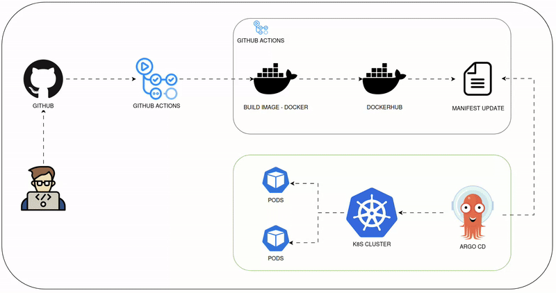

# GitOps-based Deployment Management

## 1. Overview
This project outlines a comprehensive GitOps-based deployment management system that automates application deployments following GitOps principles. The system ensures declarative infrastructure and application management through version control.

## 2. Architecture Components

### Development Tools
- **Version Control**: 
  - Application Repository (GitHub)
  - Infrastructure Repository (GitHub)
- **CI Platform**: GitHub Actions

### Infrastructure Stack
- **Containerization**: Docker
- **Container Registry**: Docker Hub
- **Container Orchestration**: Kubernetes
- **GitOps Deployment**: Argo CD
- **Monitoring Stack**:
  - Prometheus for metrics collection
  - Grafana for visualization

## 3. Deployment Pipeline

### Phase 1: Continuous Integration
1. Developer pushes code to application repository
2. GitHub Actions triggers CI pipeline:
   - Code linting and testing
   - Docker image building
   - Push to Docker Hub with proper versioning

### Phase 2: Configuration Update
1. On successful image push:
   - Update image version in infrastructure repository
   - Commit changes to appropriate environment branch

### Phase 3: Continuous Deployment
1. Argo CD monitors infrastructure repository
2. Detects configuration changes
3. Validates manifests
4. Synchronizes cluster state with repository
5. Monitors deployment health

## 4. Best Practices

- Git as single source of truth
- Declarative configurations
- Zero-downtime deployments

## 5. Troubleshooting Guide

### Common Issues
1. Image Pull Failures
   - Check registry credentials
   - Verify image tags
   - Check network connectivity

2. Sync Failures
   - Validate manifests
   - Check Argo CD logs
   - Verify repository access

3. Resource Constraints
   - Monitor resource usage
   - Adjust limits and requests

## 6. Architecture Diagram

## 7. Conclusion
This GitOps implementation provides a robust, secure, and automated deployment pipeline. By following these practices and procedures, we ensure reliable, traceable, and efficient application deployments while maintaining security and stability across environments.