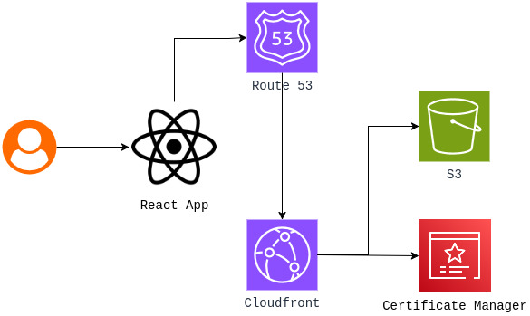
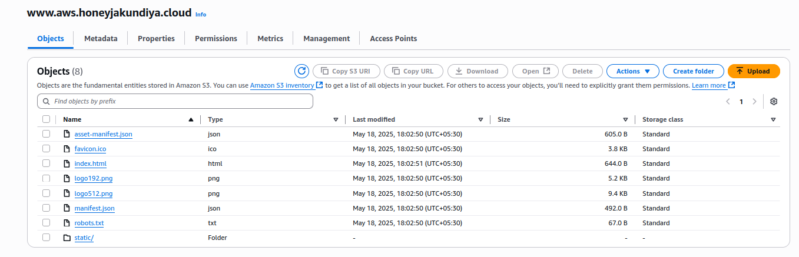
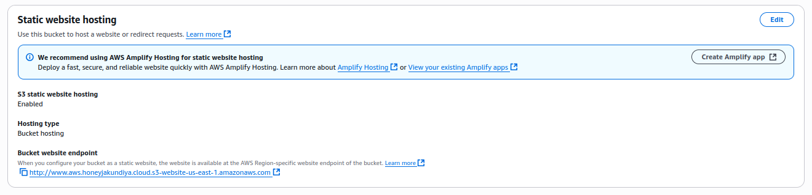
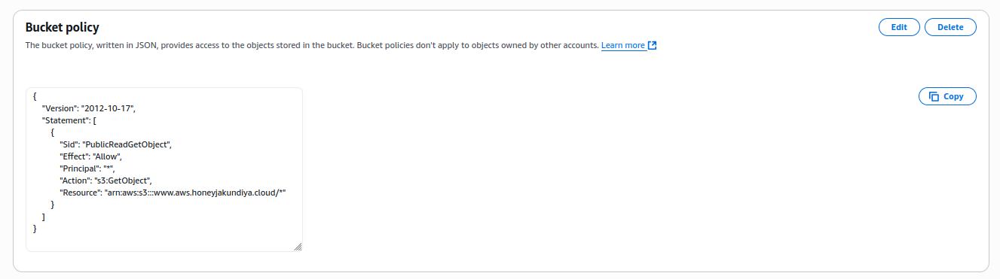
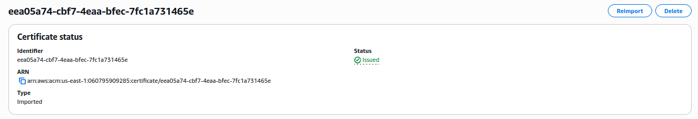
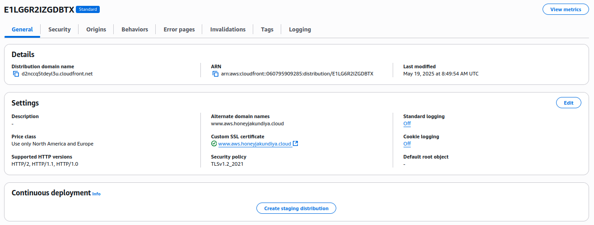
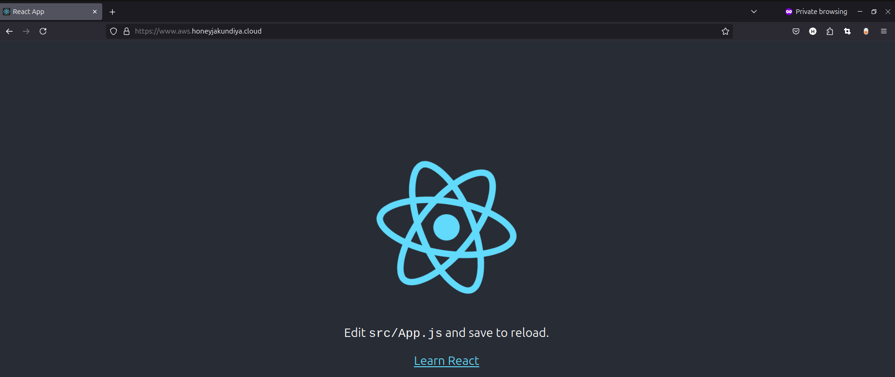

# Hosting a React App on AWS using S3 and CloudFront

This guide documents the process of deploying a React application on AWS using S3 for static content hosting, CloudFront for content delivery and caching, and AWS Certificate Manager for SSL certification.

## Table of Contents

- [Hosting a React App on AWS using S3 and CloudFront](#hosting-a-react-app-on-aws-using-s3-and-cloudfront)
  - [Table of Contents](#table-of-contents)
  - [Overview](#overview)
  - [Prerequisites](#prerequisites)
  - [Step 1: Build Your React App](#step-1-build-your-react-app)
  - [Step 2: Create and Configure an S3 Bucket](#step-2-create-and-configure-an-s3-bucket)
  - [Step 3: Upload React Build Files to S3](#step-3-upload-react-build-files-to-s3)
  - [Step 4: Secure Your App with SSL Certificate](#step-4-secure-your-app-with-ssl-certificate)
  - [Step 5: Set up CloudFront Distribution](#step-5-set-up-cloudfront-distribution)
  - [Step 6: Configure Domain and DNS](#step-6-configure-domain-and-dns)
  - [Step 7: Test Your Deployment](#step-7-test-your-deployment)
  - [Troubleshooting](#troubleshooting)
    - [Common Issues and Solutions](#common-issues-and-solutions)
  - [Conclusion](#conclusion)

## Overview


This project uses the following AWS services:
- **Amazon S3**: Stores and serves static content (HTML, CSS, JavaScript, images)
- **AWS Certificate Manager**: Provides free SSL/TLS certificates
- **Amazon CloudFront**: Serves as a CDN to cache content globally and deliver it securely via HTTPS
- **Route 53** or Your Domain Provider: For DNS management 
## Prerequisites

Before you begin, make sure you have:
- An AWS account
- AWS CLI installed and configured
- Node.js and npm installed
- A React application ready for deployment
- A domain name (optional but recommended)

## Step 1: Build Your React App

First, create a production build of your React application:

```bash
# Navigate to your React project directory
cd my-react-app

# Install dependencies if needed
npm install

# Create a production build
npm run build
```

This will generate a `build` folder containing optimized static files ready for deployment.

## Step 2: Create and Configure an S3 Bucket

1. **Log into the AWS Management Console** and navigate to S3.

2. **Create a new S3 bucket**:
   - Click "Create bucket"
   - Enter a unique bucket name (e.g., my-react-app-bucket)
   - Select your preferred region
   - Uncheck "Block all public access" (since we want to serve website content)
   - Acknowledge the warning
   - Click "Create bucket"

   

3. **Enable Static Website Hosting**:
   - Select your newly created bucket
   - Go to the "Properties" tab
   - Scroll down to "Static website hosting"
   - Click "Edit"
   - Select "Enable"
   - For "Index document", enter "index.html"
   - For "Error document", enter "index.html" (to support React Router)
   - Click "Save changes"

   

4. **Set up Bucket Policy**:
   - Go to the "Permissions" tab
   - Click "Bucket policy"
   - Enter the following policy (replace `your-bucket-name` with your actual bucket name):

   ```json
   {
     "Version": "2012-10-17",
     "Statement": [
       {
         "Sid": "PublicReadGetObject",
         "Effect": "Allow",
         "Principal": "*",
         "Action": "s3:GetObject",
         "Resource": "arn:aws:s3:::your-bucket-name/*"
       }
     ]
   }
   ```
   - Click "Save changes"

   

## Step 3: Upload React Build Files to S3

Upload the contents of your React app's build folder to the S3 bucket:

```bash
# Using AWS CLI
# Or upload manually through the AWS Console
```

After uploading, you should be able to access your website via the S3 website endpoint URL (found in the "Properties" tab under "Static website hosting").

!

## Step 4: Secure Your App with SSL Certificate

1. **Navigate to AWS Certificate Manager** (ACM) in the AWS Management Console.

2. **Request a new certificate**:
   - Click "Request a certificate"
   - Choose "Request a public certificate"
   - Click "Next"

3. **Enter domain names**:
   - Add your domain (e.g., example.com)
   - Optionally add wildcard subdomain (e.g., *.example.com)
   - Choose "DNS validation" (recommended)
   - Click "Request"

4. **Validate the certificate**:
   - For each domain, click "Create records in Route 53" (if using Route 53)
   - Otherwise, create the required DNS records with your DNS provider
   - Wait for the certificate status to change to "Issued"

	

> **Note**: The certificate must be created in the US East (N. Virginia) region (us-east-1) to be used with CloudFront.

## Step 5: Set up CloudFront Distribution

1. **Navigate to CloudFront** in the AWS Management Console.

2. **Create a new distribution**:
   - Click "Create Distribution"
   - Under "Origin Domain", select your S3 bucket website endpoint
   - Set "Origin Path" if needed (usually left blank)

3. **Configure cache behavior**:
   - Under "Cache key and origin requests":
     - Choose "CachingOptimized" for most cases
   - Under "Viewer Protocol Policy", select "Redirect HTTP to HTTPS"

4. **Configure distribution settings**:
   - Enter alternate domain names (CNAMEs) that you'll use
   - Select your SSL certificate from the dropdown
   - Under "Default Root Object", enter "index.html"
   - For "Error Pages", configure custom error responses:
     - Add a custom error response for HTTP error code 403
     - Set "Response Page Path" to "/index.html"
     - Set "HTTP Response Code" to 200
     - Repeat for error code 404

5. **Create the distribution** and wait for it to deploy (status will change from "In Progress" to "Deployed").

	

## Step 6: Configure Domain and DNS

1. **Navigate to Route 53** (or your DNS provider).

2. **Create a new record**:
   - Select your hosted zone
   - Click "Create record"
   - Enter subdomain if needed (or leave blank for apex domain)
   - Select "A - Routes traffic to an IPv4 address and some AWS resources"
   - Toggle "Alias" on
   - Select "Alias to CloudFront distribution" and choose your distribution
   - Click "Create records"

## Step 7: Test Your Deployment

1. **Wait for DNS propagation** (can take up to 48 hours, but usually much faster).

2. **Access your website** using your domain name over HTTPS.

3. **Verify functionality** by testing navigation, features, and checking for any console errors.
	



---


## Troubleshooting
### Common Issues and Solutions

1. **CloudFront showing S3 access denied errors**:
   - Verify your bucket policy is correctly set up
   - Ensure the CloudFront origin is configured properly

2. **CSS/JS not loading**:
   - Check that the files were uploaded with correct content types
   - Verify paths in your build files are correct

3. **React Router routes return 404**:
   - Ensure you've set up custom error pages in CloudFront
   - Verify S3 error document is set to index.html

4. **SSL Certificate issues**:
   - Make sure the certificate is in the us-east-1 region
   - Ensure the certificate includes all domain names you're using

## Conclusion

I've successfully deployed a React application on AWS using S3 for static content hosting and CloudFront for content delivery with SSL. This architecture provides a secure, scalable, and cost-effective solution for hosting single-page applications.

Benefits of this approach:
- **Cost-effective**: Pay only for storage and data transfer
- **Scalable**: CloudFront handles high traffic seamlessly
- **Secure**: HTTPS encryption with free SSL certificates
- **Fast**: Global content delivery through CloudFront's edge locations
---
